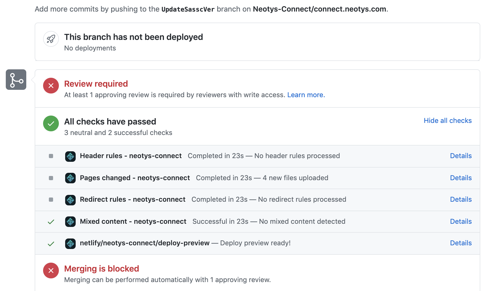

# Contributor Guidelines for Neotys Connect

- [Contributing Your Project as a Neotys-Connect Repo](#contributing-your-project-as-a-neotys-connect-repo)
- [Contributing Changes to the connect.neotys.com Portal](#contributing-changes-to-the-connectneotyscom-portal)
  * [General Process](#general-process)
  * [Pull Request Approvals](#pull-request-approvals)

## Contributing Your Project as a Neotys-Connect Repo

Please see [this tutorial](https://connect.neotys.com/contribute/publish) for what
 you need to know if you'd like to contribute a project that requires a Neotys-Connect repo.

## Contributing Changes to the connect.neotys.com Portal

This document contains the technical details on how to set up Jekyll (to see your edits locally before pushing them to GitHub), and how to prepare a pull request to make changes to content on the [connect.neotys.com](https://connect.neotys.com) website.

### General Process

- [Install Jekyll](https://jekyllrb.com/docs/installation/)
- [Fork this repository](https://docs.github.com/en/github/getting-started-with-github/fork-a-repo)
- [create a new branch](https://git-scm.com/book/en/v2/Git-Branching-Basic-Branching-and-Merging) in your fork repo before you start working
- make changes and then [test them locally with Jekyll serve](https://jekyllrb.com/docs/)
- [push them](https://git-scm.com/docs/git-push) back to your fork branch
- [create a new Github Pull Request](https://docs.github.com/en/github/collaborating-with-issues-and-pull-requests/creating-a-pull-request-from-a-fork) for your fork branch to the [connect repo main](https://github.com/Neotys-Connect/connect.neotys.com/tree/main)

### Preview Your Pull Request in Netlify

After submitting a Pull Request, you should soon see that checks are running, one
 of which is to deploy your branch as a unique staging site on Netlify! This is
 what the  will use to visually verify that your changes are acceptable.

If you need to fix something, simply do so locally by changing files (don't forget
 to use Jekyll to locally preview these changes), then push another commit to the
 same branch you created your pull request from. Afterwhich, go back to the pull
 request status page and see that the Netlify status checks have run again for
 an updated version of your site.

### Pull Request Approvals

The  does it's best to respect the value of your work by reviewing
 and approving as quickly as humanly possible, however to make sure nefarious or plain broken
 contributions aren't automatically published to the site, we do manually review
 each pull request. Once it is approved, you will be notified by Github and if
 you've reached out to the , we will reply to you directly as well.
